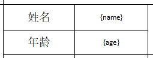

## Word转PDF工具

#### 概述
该工具是建立在word模板之上，配合具体的api使用完成数据映射以及表格扩展。
下方将介绍使用的几种场景和对应的语法。
   
   * 本文档是在以下依赖版本1.0.0-SNAPSHOT上，后续版本产生代码方法变更，可作为参考。
   * 默认字体为宋体，已绑定在本包中, 无需在操作系统中再次安装。

### 一、安装
  略

### 二、使用
下述样例：Student类

#### 1. 静态变量绑定
  （1）如果要将单个Student对象的值传到word上，可以在word模板中，使用以下语法。
   
   Word模板语法：
    
        {对象.属性}
        

API示例：
    
      Student abc = new Student(“小明”, 12);
      Word2PdfBuilder.newInstance(word模板)
                     .build(abc)
         		     .toPDF();
    
* 解释： 在以上示例中，abc为Student对象引用，在不指定对象变量名称的情况下，自动使用类名的小驼峰形式student作为前缀，扫描word中是否存在Student类的各个成员变量绑定，如果存在则替换为对应的值。

（2）如果word中存在多个Student对象绑定，可以为每个对象指定单独的对象名称：

     

API示例：
    
    Student abc = new Student(“小明”, 12);
    Student abcd = new Student(“小张”, 11);
    Word2PdfBuilder.newInstance(word模板)
                   .build(abc, “abc”)
                   .build(abcd, “abcd”)
     	           .toPDF();  

     
   

 (3) 如果Word模板中存在多个Student对象绑定，除了为每个对象指定单独的名称，也可以放入一个Student的List数组，放入List数组可以通过下标顺序渲染到word上。
 
 Word模板语法：
    
        {对象[下标].属性}

    

API示例：

    List<Student> list = new ArrayList<>();
    Student abc = new Student(“小明”, 12);
    list.add(abc);
    Student abcd = new Student(“小张”, 11);
    list.add(abcd);
    
    Word2PdfBuilder.newInstance(word模板)
                   .build(list)
                   .toPDF();

    
 
也可以重命名对象引用名称。

    Word2PdfBuilder.newInstance(word模板)
                   .build(list, “myStudent”)
                   .toPDF();

(4) 如果word需要绑定Map对象
  
  Word模板语法
  
    {key} 或 {name.key}

A. 如果要绑定单个Map对象

   
  
API示例：
       
           Map<String, String> map = new HashMap<>();
           Map.put(“name”, “小张”);
           Map.put(“age”, 10);
           Word2PdfBuilder.newInstance(word模板)
                          .build(map)
            	          .toPDF();

   

B.如果word模板中需要绑定多个Map，可以为每个Map指定对象名称。

   

    Map<String, String> map1 = new HashMap<>();
    Map.put(“name”, “小明”)；
    Map.put(“age”, 11);
    
    Map<String, String> map2 = new HashMap<>();
    Map.put(“name”, “小张”)；
    Map.put(“age”, 10);
    
    Word2PdfBuilder.newInstance(word模板)
                   .build(map1, “map1”)
                   .build(map2, “map2”)
     	           .toPDF();
    

#### 2. 动态变量绑定  
	       
 word模板语法：
    
    {对象[i].属性}

* [i]是固定写法，指代变量

**用法说明:**

变量占用行为第一行，制作好第一行的样式，程序将参照样式进行复制生成后续的行和列。

API示例：
   
    List<Student> list = new ArrayList<>();
    Student abc = new Student(“小明”, 12);
    list.add(abc);
    Student abcd = new Student(“小张”, 11);
    list.add(abcd);
    
    Word2PdfBuilder.newInstance(word模板)
                   .buildAutoList(list)
     	           .toPDF();

#### 3. 图片替换
   
   在word模板目标位置插入图片样例，调整好样式。然后通过API替换图片的数据实现图片替换。
   
   

API示例：
    
    InputStream inputStream = getClass().getResourceAsStream(“/static/test.jpg”);
    // InputStram可以是任何形式的输入流.
    Word2PdfBuilder.newInstance(word模板)
                   .replaceImage(inputStream)
     	       .toPDF();

该API默认替换word模板中从上到下第一张图片，下标从0开始。如果要替换指定位置的图片，可以使用指定下标
    
    Word2PdfBuilder.newInstance(word模板)
                   .replaceImage(1，inputStream)
                   .toPDF();
   

#### 4. 字体和字号
 
 支持对指定表格进行字体设置和字号设置，字体设置前确保系统中存在该字体。
 
    List<Student> list = new ArrayList<>();
    Student abc = new Student(“小明”, 12);
    list.add(abc);
    Student abcd = new Student(“小张”, 11);
    list.add(abcd);
    
    Word2PdfBuilder.newInstance(word模板)
                   .buildAutoList(list)
                   .defaultTableStyle()
     	           .toPDF();

defaultTableStyle()方法默认为宋体8号字体。

也可以使用下面方法指定要替换的字体和字号。

    Word2PdfBuilder.newInstance(word模板)
                   .buildAutoList(list)
                   .tableStyle(TableStyle.builder()
           		            .fontSize(16)
            		    .fontFamily("黑体")
            		    .build()) 						  
                   .toPDF();

如果有多个表格，也可以指定具体的Table, 从上到下，下标从0开始。

    
    Word2PdfBuilder.newInstance(word模板)
                   .buildAutoList(list)
                   .tableStyle(2, TableStyle.builder()
           				 .fontSize(16)
            			 .fontFamily("黑体")
            			 .build()) 						  
                   .toPDF();
                   
#### 5. 日期
 支持对Date对象格式自动转换
 默认日期格式：
    
    yyyy-MM-dd hh:mm:ss
 
#### 6. 支持输出Doc文档和PDF文档
 
    Word2PdfBuilder.newInstance(word模板)
                   .buildAutoList(list)				  
                   .toDocx();
    
    Word2PdfBuilder.newInstance(word模板)
                   .buildAutoList(list)				  
                   .toPDF();

#### 7.支持输出为流对象和文件对象。
    
    InputStream inputStream = Word2PdfBuilder.newInstance(word模板)
      		           .buildAutoList(list)				  
                       .toPDF();
        
    File file = new File(“D:\\abc.pdf”);
    Word2PdfBuilder.newInstance(word模板)
                   .buildAutoList(list)				  
                   .toPDF(file);

#### 8. 支持返回带坐标的PDF
   如果需要定位PDF某一处或者多处位置坐标，可以在word文本中插入特殊标记符，假设标记字符为#和￥,
   然后使用方法toPDFWithPosition()，将返回一个PDFPosition对象。
    
    PDFPosition position = Word2PdfBuilder.newInstance(word模板)
          		           .buildAutoList(list)				  
                           .toPDFWithPosition("#","￥");
                    
  PDFPosition对象包含了两个参数，一个是生成的PDF文档，这个PDF已自动去掉Word模板中的特殊标识符，另一个是特殊字符坐标数组。
    
    public class PDFPosition {
    
        /**
         *  坐标数组
         */
        private List<Position> positions;
    
        /**
         *  生成的PDF文档
         */
        private InputStream inputStream;
    
    }
  
  坐标数组中Position结构如下， 它将返回每个特殊字符所定位的x,y坐标及所在页码，支持单页多符，多页多符：
    
    public class Position {
    
        /**
         *  横坐标
         */
        private String x;
    
        /**
         *  纵坐标
         */
        private String y;
    
        /**
         *  所在页码
         */
        private Integer page;
    
        /**
         *  指定的标识符
         */
        private String charact;
    }
  
#### 9.对象为空值或者绑定变量不存在时，自动填充空白字符串。
    

    
      
#### 10.注意事项
   1. 如果项目运行过程出现word模板无法加载或者加载格式出错，应检查word模板是否在加载过程中被编译过。
   要避免被编译，可以在maven中配置：
   
        
        <build>
            <plugins>
                <plugin>
                    <groupId>org.apache.maven.plugins</groupId>
                    <artifactId>maven-resources-plugin</artifactId>
                    <configuration>
                        <nonFilteredFileExtensions>
                            <nonFilteredFileExtension>doc</nonFilteredFileExtension>
                            <nonFilteredFileExtension>docx</nonFilteredFileExtension>
                        </nonFilteredFileExtensions>
                    </configuration>
                </plugin>
            </plugins>
        </build>